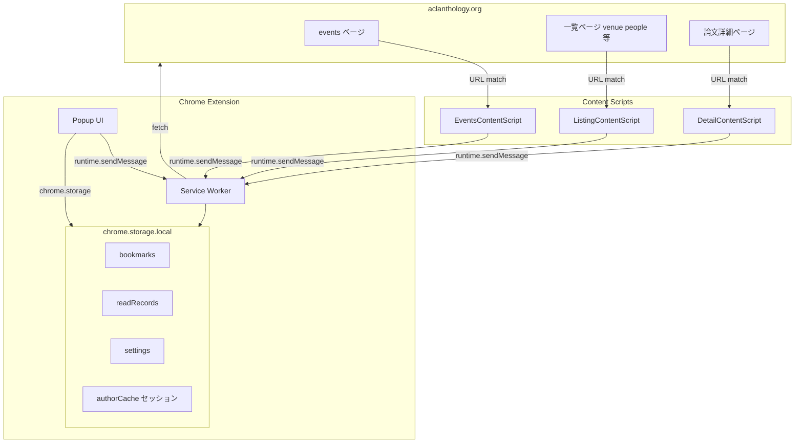
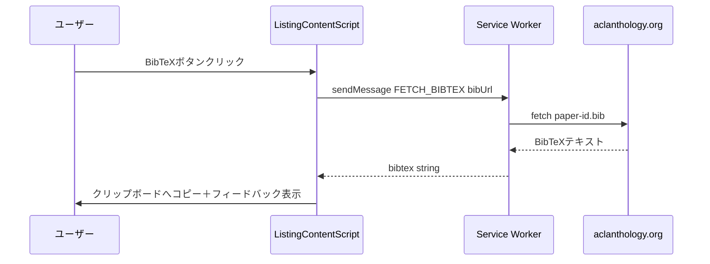
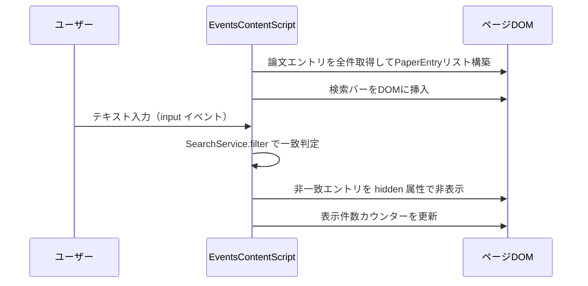
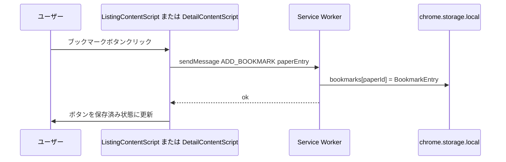

# Design Document: acl-anthology-chrome-extension

## Overview

本拡張機能は、ACL Anthology（aclanthology.org）のウェブインターフェースを拡張し、NLP研究者の日常的な文献調査作業を効率化するChrome拡張機能である。BibTeXの即時コピー・アブストラクトのインラインプレビュー・PDFクイックアクセス・論文ブックマーク・イベントページ内検索・著者探索・既読トラッキングの7機能を提供する。

対象ユーザーはNLP研究者・大学院生・実務エンジニアであり、aclanthology.orgドメイン上でのみ動作する。ユーザーデータはすべて`chrome.storage.local`に保存し、外部サービスへの通信は行わない（BibTeX・著者情報のfetchはACL Anthology自身への通信のみ）。

### Goals

- 論文一覧ページでのBibTeXコピーをページ遷移なしで実現する
- イベントページ（`/events/*/`）でタイトル・著者・アブストラクト対象のリアルタイム検索を提供する
- ブックマーク・既読状態をブラウザローカルに永続化し、エクスポート手段を提供する
- すべてのデータ操作をType-safe TypeScriptインターフェースで定義する

### Non-Goals

- キーボードショートカット機能（スコープ外）
- ACL Anthology以外のサイトへの対応
- デバイス間データ同期（`chrome.storage.sync`は不使用）
- 外部文献管理サービス（Zotero、Mendeley等）との連携

---

## Architecture

### Architecture Pattern & Boundary Map

Chrome Extension Manifest V3のコンテンツスクリプト中心パターンを採用する。コンテンツスクリプトはページタイプ別に3種類定義し、DOM操作とUI描画を担う。Service WorkerはHTTPフェッチとストレージ操作の委譲先として機能する。



**アーキテクチャ決定**:
- コンテンツスクリプトはDOM操作とUI描画のみを担い、永続化・フェッチはService Worker経由に委譲する（CORSとMV3制約への対応）
- `localStorage`は使用禁止。Service WorkerからアクセスできないためMV3非対応（`research.md`参照）
- 著者情報キャッシュは`chrome.storage.local`の`authorCache`キーに保存し、セッション内の重複フェッチを回避する

### Technology Stack

| Layer | 選択 / バージョン | 役割 | 備考 |
|-------|------------------|------|------|
| 言語 | TypeScript 5.x（strict mode） | 全コンポーネント | `any`型禁止 |
| ランタイム | Chrome Extension MV3 | 拡張機能基盤 | Service Worker + Content Scripts |
| UI | Vanilla HTML/CSS | Popup・インジェクションUI | フレームワーク不使用（軽量化） |
| ストレージ | chrome.storage.local | 永続データ | 10MB上限、全コンテキストからアクセス可能 |
| ビルド | Vite + vite-plugin-web-extension | バンドル・開発サーバー | TypeScriptトランスパイル |
| テスト | Vitest + happy-dom | ユニット・統合テスト | DOM操作のモック |

---

## System Flows

### BibTeX コピーフロー（一覧ページ）



### イベントページ リアルタイム検索フロー



### ブックマーク追加フロー



---

## Requirements Traceability

| Requirement | Summary | Components | Interfaces | Flows |
|-------------|---------|------------|------------|-------|
| 1.1–1.4 | BibTeXコピー（一覧・詳細） | ListingCS, DetailCS, BibtexService | `BibtexService`, `MessageProtocol` | BibTeXコピーフロー |
| 2.1–2.5 | アブストラクトプレビュー | ListingCS, AbstractPreviewUI | `AbstractPreviewProps` | — |
| 3.1–3.4 | PDFクイックアクセス | ListingCS, DomExtractor | `PaperEntry.pdfUrl` | — |
| 4.1–4.5 | ブックマーク管理 | ListingCS, DetailCS, Popup, StorageService | `StorageService`, `BookmarkEntry` | ブックマーク追加フロー |
| 5.1–5.6 | イベントページ検索 | EventsCS, SearchService | `SearchService` | リアルタイム検索フロー |
| 6.1–6.5 | 著者・関連論文探索 | ListingCS, DetailCS, AuthorService | `AuthorService`, `AuthorCacheEntry` | — |
| 7.1–7.5 | 既読・未読トラッキング | ListingCS, DetailCS, Popup, StorageService | `StorageService`, `ReadRecord` | — |

---

## Components and Interfaces

### コンポーネント概要

| Component | Layer | Intent | Req Coverage | Key Dependencies | Contracts |
|-----------|-------|--------|--------------|------------------|-----------|
| EventsContentScript | Content Script | イベントページへの検索バー注入とリアルタイムフィルタリング | 5.1–5.6 | SearchService, DomExtractor | State |
| ListingContentScript | Content Script | 一覧ページへのUI注入（BibTeX・PDF・アブストラクト・ブックマーク・著者ポップアップ・既読） | 1.1–1.3, 2.1–2.5, 3.1–3.4, 4.1, 6.1–6.2, 7.1–7.2 | BibtexService, StorageService, AuthorService, DomExtractor | Service, State |
| DetailContentScript | Content Script | 論文詳細ページへのUI注入（BibTeX・ブックマーク・著者パネル・訪問記録） | 1.4, 4.1–4.4, 6.3–6.5, 7.3 | BibtexService, StorageService, AuthorService | Service, State |
| ServiceWorker | Background | HTTPフェッチ委譲・メッセージルーティング | 1.1–1.3, 6.1–6.5 | chrome.storage, fetch API | Service, API |
| Popup | Extension UI | ブックマーク一覧表示・エクスポート | 4.2–4.5, 7.4–7.5 | StorageService | State |
| StorageService | Shared Service | chrome.storage.localの読み書き・エクスポート | 4.1–4.5, 7.1–7.5 | chrome.storage.local | Service |
| BibtexService | Shared Service | BibTeX取得（DOM or フェッチ）・クリップボードコピー | 1.1–1.4 | ServiceWorker（フェッチ委譲） | Service |
| AuthorService | Shared Service | 著者論文フェッチ・キャッシュ管理 | 6.1–6.5 | ServiceWorker（フェッチ委譲） | Service |
| SearchService | Shared Service | クエリに基づく論文フィルタリング | 5.1–5.6 | — | Service |
| DomExtractor | Shared Utility | ACL AnthologyのDOMから`PaperEntry`を抽出 | 全件 | DOM API | — |

---

### Content Scripts

#### EventsContentScript

| Field | Detail |
|-------|--------|
| Intent | `/events/*/`ページに検索バーを注入し、入力に応じてリアルタイムに論文エントリを絞り込む |
| Requirements | 5.1, 5.2, 5.3, 5.4, 5.5, 5.6 |

**Responsibilities & Constraints**
- 対象URL: `https://aclanthology.org/events/*`
- 論文エントリのDOM要素リストを初期化時に構築し、各エントリに`PaperEntry`をdata属性として紐付ける
- 入力イベントごとに`SearchService.filter`を呼び出してDOM要素の`hidden`属性を更新する
- アブストラクトがDOM内に存在しない場合はタイトル・著者名のみを検索対象とする（5.6）

**Dependencies**
- Inbound: なし（ページロードにより自動起動）
- Outbound: `SearchService` — フィルタリングロジック（P0）
- Outbound: `DomExtractor` — `PaperEntry`の構築（P0）

**Contracts**: State [x]

##### State Management
- State model: `{ query: string; totalCount: number; visibleCount: number; paperElements: PaperElementBinding[] }`
- Persistence & consistency: 状態はページセッション内メモリのみ（永続化不要）
- Concurrency strategy: 単一スレッド（JSイベントループ）、デバウンスなし（`input`イベント同期処理）

**Implementation Notes**
- Integration: `DOMContentLoaded`後に実行。動的ロードコンテンツ（ページネーション等）がある場合は`MutationObserver`を追加検討
- Validation: 論文エントリが0件の場合は検索バーを非表示にする
- Risks: ACL AnthologyのDOM構造変更でセレクターが無効化されるリスク → セレクター定数を`selectors.ts`に集約

---

#### ListingContentScript

| Field | Detail |
|-------|--------|
| Intent | 論文一覧ページ（会議・著者・検索結果）の各エントリにBibTeX・PDF・アブストラクト・ブックマーク・著者ポップアップ・既読ボタンを注入する |
| Requirements | 1.1, 1.2, 1.3, 2.1, 2.2, 2.3, 2.4, 2.5, 3.1, 3.2, 3.3, 3.4, 4.1, 6.1, 6.2, 7.1, 7.2 |

**Responsibilities & Constraints**
- 対象URL: `https://aclanthology.org/*`（events/*は除外しEventsCSに委譲）
- 各論文エントリのホバー時にアクションボタン群を表示する
- `BibtexService`・`StorageService`・`AuthorService`への依存はメッセージ経由（Service Worker）またはChrome Storage API直接アクセス

**Dependencies**
- Outbound: `BibtexService` — BibTeX取得（P0）
- Outbound: `StorageService` — ブックマーク・既読状態の読み書き（P0）
- Outbound: `AuthorService` — 著者ポップアップデータ取得（P1）
- Outbound: `DomExtractor` — `PaperEntry`構築（P0）

**Contracts**: Service [x] / State [x]

##### Service Interface

```typescript
interface ListingContentScriptAPI {
  copyBibtex(paperId: string): Promise<Result<void, ContentScriptError>>;
  toggleAbstractPreview(paperId: string, anchorEl: HTMLElement): void;
  openPdf(pdfUrl: string): void;
  toggleBookmark(paper: PaperEntry): Promise<Result<void, ContentScriptError>>;
  toggleReadMark(paperId: string): Promise<Result<void, ContentScriptError>>;
  showAuthorPopup(authorSlug: string, anchorEl: HTMLElement): Promise<void>;
}
```

- Preconditions: `DOMContentLoaded`完了済み、`PaperEntry`が正常に抽出済み
- Postconditions: UIの状態がStorage状態と同期している
- Invariants: ブックマーク状態とStorage値の一致

**Implementation Notes**
- Integration: 既存DOMを破壊せず、UIコンポーネントをエントリ要素の子として注入する
- Validation: `DomExtractor`が`PaperEntry`を返せなかった場合はボタン注入をスキップ
- Risks: ホバーイベントの多重発火によるUI重複表示 → フラグで防止

---

#### DetailContentScript

| Field | Detail |
|-------|--------|
| Intent | 論文詳細ページにBibTeXコピーボタン・ブックマークボタン・著者サイドパネルを注入し、訪問記録を自動保存する |
| Requirements | 1.4, 4.1, 4.2, 4.4, 6.3, 6.4, 6.5, 7.3 |

**Responsibilities & Constraints**
- 対象URL: `https://aclanthology.org/{paper-id}/`（論文ID形式のURLのみ）
- ページロード時に自動的に訪問記録を`StorageService`に保存する（7.3）
- BibTeXは`<div id="citeBibtex"><pre>`から直接取得（フェッチ不要）

**Dependencies**
- Outbound: `StorageService` — 訪問記録・ブックマーク（P0）
- Outbound: `AuthorService` — 著者サイドパネルデータ（P1）
- Outbound: `DomExtractor` — ページからの`PaperEntry`構築（P0）

**Contracts**: Service [x] / State [x]

**Implementation Notes**
- Integration: `window.location.pathname`で論文詳細ページかどうかを判定してから処理開始
- Validation: `paperId`がACL Anthology IDパターン（例: `2024.acl-long.1`）に一致することを確認
- Risks: 著者パネルがページレイアウトを崩す可能性 → `position: sticky`のサイドバーとして実装

---

### Shared Services

#### StorageService

| Field | Detail |
|-------|--------|
| Intent | `chrome.storage.local`への型付きアクセスを提供し、ブックマーク・既読記録・設定の読み書きとエクスポートを担う |
| Requirements | 4.1, 4.2, 4.4, 4.5, 7.1, 7.2, 7.3, 7.4, 7.5 |

**Responsibilities & Constraints**
- すべての`chrome.storage.local`操作を一元管理する
- エクスポートはJSON（ブックマーク）とCSV（既読記録）の2形式をサポート
- ストレージ使用量が9MBを超えた場合に警告を返す

**Dependencies**
- External: `chrome.storage.local` — 永続化（P0）

**Contracts**: Service [x] / State [x]

##### Service Interface

```typescript
type Result<T, E> = { ok: true; value: T } | { ok: false; error: E };

interface StorageError {
  kind: 'quota_exceeded' | 'read_error' | 'write_error';
  message: string;
}

interface StorageService {
  // Bookmarks
  getBookmarks(): Promise<Result<Record<string, BookmarkEntry>, StorageError>>;
  addBookmark(paper: PaperEntry): Promise<Result<void, StorageError>>;
  removeBookmark(paperId: string): Promise<Result<void, StorageError>>;
  isBookmarked(paperId: string): Promise<boolean>;

  // Read Records
  getReadRecords(): Promise<Result<Record<string, ReadRecord>, StorageError>>;
  markAsRead(paperId: string): Promise<Result<void, StorageError>>;
  markAsVisited(paperId: string): Promise<Result<void, StorageError>>;

  // Settings
  getSettings(): Promise<ExtensionSettings>;
  updateSettings(patch: Partial<ExtensionSettings>): Promise<Result<void, StorageError>>;

  // Export
  exportBookmarksAsJSON(): Promise<string>;
  exportReadRecordsAsCSV(): Promise<string>;
}
```

- Preconditions: `chrome.storage.local`が利用可能（拡張機能コンテキスト内）
- Postconditions: 書き込み成功後、同一キーの読み込みは更新値を返す
- Invariants: `paperId`はACL Anthology IDフォーマット（英数字とドット）のみ許容

---

#### BibtexService

| Field | Detail |
|-------|--------|
| Intent | 論文のBibTeXを取得（DOM直接取得またはService Worker経由フェッチ）してクリップボードにコピーする |
| Requirements | 1.1, 1.2, 1.3, 1.4 |

**Contracts**: Service [x]

##### Service Interface

```typescript
interface BibtexError {
  kind: 'fetch_failed' | 'clipboard_denied' | 'not_found';
  message: string;
}

interface BibtexService {
  /** 詳細ページDOMからBibTeXを取得 */
  getFromDom(): Result<string, BibtexError>;
  /** .bibURLからService Worker経由でフェッチ */
  fetchFromUrl(bibUrl: string): Promise<Result<string, BibtexError>>;
  /** クリップボードにコピー */
  copyToClipboard(bibtex: string): Promise<Result<void, BibtexError>>;
}
```

- Preconditions: `bibUrl`は`/paper-id.bib`形式のACL Anthology相対パスまたは絶対URL
- Postconditions: `copyToClipboard`成功後、クリップボードにBibTeXテキストが格納される

---

#### AuthorService

| Field | Detail |
|-------|--------|
| Intent | 著者スラッグをキーに著者の最近の論文リストをフェッチし、セッションキャッシュを管理する |
| Requirements | 6.1, 6.2, 6.3, 6.4, 6.5 |

**Contracts**: Service [x]

##### Service Interface

```typescript
interface AuthorError {
  kind: 'fetch_failed' | 'parse_failed';
  message: string;
}

interface AuthorService {
  /** 著者の最近の論文を最大maxCount件取得（キャッシュ優先） */
  getRecentPapers(
    authorSlug: string,
    maxCount: number
  ): Promise<Result<PaperEntry[], AuthorError>>;
}
```

- Preconditions: `authorSlug`は`/people/{slug}/`形式から抽出された値
- Postconditions: キャッシュ済みの場合は同期的に返す（`chrome.storage.local`）

---

#### SearchService

| Field | Detail |
|-------|--------|
| Intent | クエリ文字列と論文リストを受け取り、マッチしたエントリのインデックスセットを返す純粋関数 |
| Requirements | 5.2, 5.3, 5.6 |

**Contracts**: Service [x]

##### Service Interface

```typescript
interface SearchService {
  /**
   * queryにマッチするPaperEntryのindexセットを返す。
   * queryが空文字の場合は全件を返す。
   * abstractが未定義のエントリはtitle・authorsのみで評価する（5.6）。
   */
  filter(
    papers: PaperEntry[],
    query: string
  ): Set<number>;
}
```

- Preconditions: `query`は空文字を含む任意の文字列（undefined不可）
- Postconditions: 返却されるSetのindexはpapers配列の添字と対応
- Invariants: 大文字・小文字を区別しない部分一致マッチング

---

#### DomExtractor

| Field | Detail |
|-------|--------|
| Intent | ACL AnthologyのページDOMから`PaperEntry`オブジェクトを抽出するユーティリティ |
| Requirements | 全件（DOM抽出は各コンポーネントの前提） |

**Contracts**: Service [x]

##### Service Interface

```typescript
interface DomExtractor {
  /** 論文一覧ページの全エントリを抽出 */
  extractListingEntries(root: Document): PaperElementBinding[];
  /** 論文詳細ページから単一エントリを抽出 */
  extractDetailEntry(root: Document): PaperEntry | null;
}

interface PaperElementBinding {
  paper: PaperEntry;
  element: HTMLElement;
}
```

**Implementation Notes**
- Integration: すべてのセレクターは`src/constants/selectors.ts`に定数として定義し、DOM構造変更時の変更箇所を局所化する
- Validation: 必須フィールド（`id`, `title`）が取得できない場合は`null`を返す
- Risks: ACL AnthologyのDOM構造変更 → Integration Testでセレクターの有効性を検証

---

### Service Worker

#### ServiceWorker

| Field | Detail |
|-------|--------|
| Intent | コンテンツスクリプトからのメッセージを受け取り、HTTPフェッチとストレージ操作を委譲する |
| Requirements | 1.1, 1.2, 1.3, 6.1–6.5 |

**Dependencies**
- Inbound: Content Scripts — `runtime.sendMessage`経由（P0）
- Outbound: `chrome.storage.local` — 永続化（P0）
- External: `aclanthology.org` — BibTeX・著者ページのフェッチ（P1）

**Contracts**: Service [x] / API [x]

##### API Contract（メッセージプロトコル）

| Action | Request | Response | Errors |
|--------|---------|----------|--------|
| `FETCH_BIBTEX` | `{ bibUrl: string }` | `{ bibtex: string }` | `{ error: 'fetch_failed' \| 'not_found' }` |
| `FETCH_AUTHOR_PAPERS` | `{ authorSlug: string; maxCount: number }` | `{ papers: PaperEntry[] }` | `{ error: 'fetch_failed' \| 'parse_failed' }` |

```typescript
type MessageRequest =
  | { action: 'FETCH_BIBTEX'; bibUrl: string }
  | { action: 'FETCH_AUTHOR_PAPERS'; authorSlug: string; maxCount: number };

type MessageResponse<T> =
  | { ok: true; value: T }
  | { ok: false; error: string };
```

---

## Data Models

### Domain Model

- **PaperEntry**: 論文の識別情報・表示情報を保持する値オブジェクト。`paperId`をキーとして各Storeで参照
- **BookmarkEntry**: `PaperEntry`に保存日時を付加した集約ルート
- **ReadRecord**: 論文の既読状態と訪問履歴を管理する値オブジェクト
- **ExtensionSettings**: ユーザー設定の集約（アブストラクトプレビュー有効/無効等）
- **AuthorCacheEntry**: 著者論文リストのキャッシュエントリ（TTLとして`cachedAt`を保持）

### Logical Data Model

```typescript
interface PaperEntry {
  readonly paperId: string;       // ACL ID（例: "2024.acl-long.1"）
  readonly title: string;
  readonly authors: readonly string[];
  readonly abstract?: string;
  readonly pdfUrl?: string;
  readonly bibUrl: string;        // 相対または絶対URL
  readonly pageUrl: string;
}

interface BookmarkEntry {
  readonly paperId: string;
  readonly savedAt: string;       // ISO 8601
  readonly paper: PaperEntry;
}

interface ReadRecord {
  readonly paperId: string;
  readonly isRead: boolean;
  readonly markedReadAt?: string;   // 明示的既読マーク日時
  readonly visitedAt?: string;      // 初回訪問日時（自動記録）
}

interface ExtensionSettings {
  readonly abstractPreviewEnabled: boolean;
}

interface AuthorCacheEntry {
  readonly authorSlug: string;
  readonly recentPapers: readonly PaperEntry[];
  readonly cachedAt: string;        // ISO 8601
}
```

### Physical Data Model（chrome.storage.local）

```typescript
interface StorageSchema {
  bookmarks: Record<string, BookmarkEntry>;       // key: paperId
  readRecords: Record<string, ReadRecord>;         // key: paperId
  settings: ExtensionSettings;
  authorCache: Record<string, AuthorCacheEntry>;  // key: authorSlug
}
```

**一貫性**:
- `bookmarks`と`readRecords`は独立して読み書き可能（結合整合性不要）
- `authorCache`はTTLを`cachedAt`から計算し、60分超過エントリは再フェッチ

---

## Error Handling

### Error Strategy

Chrome拡張機能の特性上、外部ページへのフェッチ失敗・クリップボード権限拒否・ストレージ容量超過が主要エラーシナリオである。いずれも`Result<T, E>`型でエラーを表現し、例外スローを避ける。UIはエラー時に部分機能を提供する（グレースフルデグレード）。

### Error Categories and Responses

| カテゴリ | 原因 | UI応答 |
|---------|------|-------|
| ネットワークエラー | BibTeX・著者情報フェッチ失敗 | エラーメッセージをインライン表示。論文ページへの手動リンクを提供（1.3, 6.4） |
| クリップボード権限拒否 | `navigator.clipboard.writeText`拒否 | テキストエリアにフォールバック表示でユーザーが手動コピー可能にする |
| ストレージ容量超過 | `chrome.storage.local`の10MB上限 | 操作失敗を通知し、エクスポートを促す |
| DOM構造不一致 | セレクター無効（ACL Anthology更新） | 該当エントリのUI注入をスキップし、エラーログを`console.error`に出力 |
| データなし | アブストラクト未掲載論文 | タイトル・著者のみで検索（5.6）。プレビュー時は「アブストラクト未掲載」を表示 |

### Monitoring

- ストレージ使用量は起動時に確認し、9MB超過で`console.warn`を出力
- フェッチエラーはService Workerの`console.error`に記録

---

## Testing Strategy

### Unit Tests（Vitest + happy-dom）

- `SearchService.filter`: 空クエリ・全件一致・部分一致・大文字小文字無視・アブストラクト未定義時のフォールバック
- `DomExtractor.extractListingEntries`: ACL AnthologyのHTMLスナップショットから正しく`PaperEntry`が抽出されるか
- `StorageService`: `addBookmark`・`removeBookmark`・`isBookmarked`の状態遷移
- `BibtexService.getFromDom`: `<div id="citeBibtex"><pre>`からのBibTeX抽出

### Integration Tests

- `EventsContentScript`と`SearchService`の結合: 検索バー注入 → 入力 → DOM絞り込みの動作確認
- `ListingContentScript`と`StorageService`の結合: ブックマークボタンクリック → chrome.storage書き込みの動作確認
- Service Worker メッセージハンドリング: `FETCH_BIBTEX`メッセージ → フェッチ → レスポンスの往復

### E2E Tests（Chrome WebDriver / Playwright）

- イベントページでの検索フロー: テキスト入力 → 論文絞り込み → クリア後全件表示
- BibTeXコピーフロー: 一覧ページでのボタンクリック → クリップボード確認
- ブックマーク管理フロー: 追加 → Popupで確認 → 削除

---

## Security Considerations

- `host_permissions`は`https://aclanthology.org/*`のみに制限し、最小権限の原則を遵守する
- コンテンツスクリプトがinjectするHTML要素は`textContent`のみでDOMに挿入し、`innerHTML`は使用しない（XSS防止）
- BibTeXテキストをクリップボードに書き込む際、サニタイズは不要（プレーンテキストのみ）
- 外部ユーザー入力（検索クエリ）はDOMへのレンダリング前にエスケープする

## Performance & Scalability

- イベントページの論文エントリ数が数百件の場合でも、DOMフィルタリングは`hidden`属性の切り替えのみで実行するため、再レンダリングコストは最小限
- `SearchService.filter`はデバウンスなしで`input`イベントごとに同期実行するが、フィルタリングロジックは`O(n * m)`（nが論文数、mがクエリ長）であり許容範囲内
- 著者キャッシュのTTLは60分。キャッシュヒット時はService Workerへのメッセージ送信をスキップ
- `chrome.storage.local`への書き込みは操作ごとに行い、バッチ書き込みは行わない（データ損失リスク回避）
